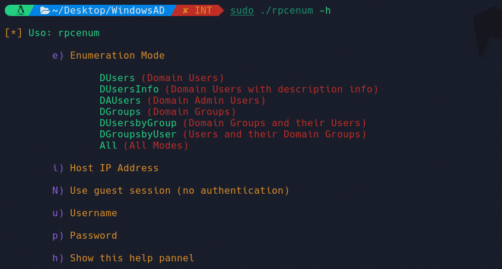
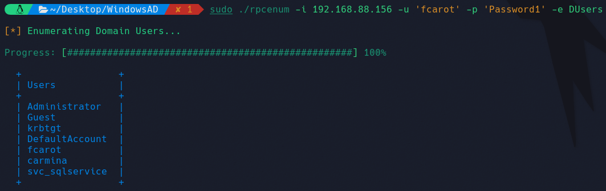
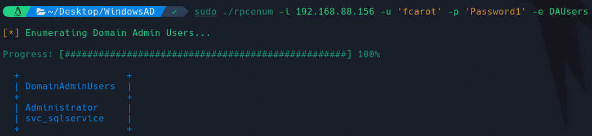
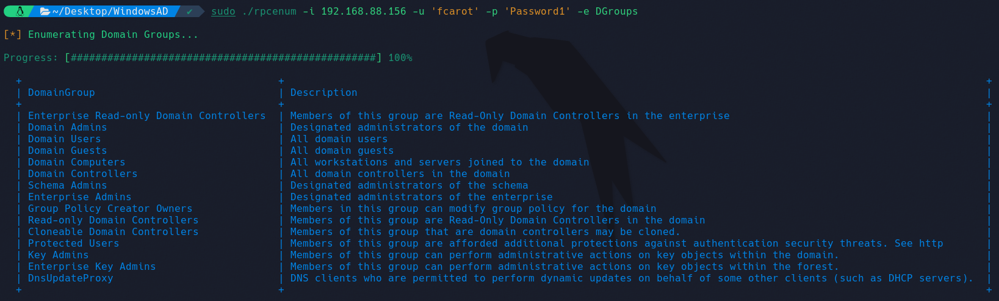

# RPCenum Enhanced Features

Rpcenum es una herramienta de línea de comandos, originalmente desarrollada por s4vitar, que permite la **enumeración de información de dominio** en sistemas Windows **mediante** el protocolo **RPC** (Remote Procedure Call). 

En su versión original, permitía la enumeración utilizando un *Null Session* (sin autenticación) si la máquina objetivo lo permitía. Sin embargo, se ha ampliado su funcionamiento para **incluir la autenticación mediante credenciales** de usuario válidas, proporcionando así una mayor flexibilidad y capacidad de adaptación a diferentes entornos y restricciones de seguridad implementadas en los sistemas que se están examinando.

Además de esta funcionalidad, rpcenum también ha sido actualizada con nuevas características. En particular, se han añadido **barras de progreso** para todos los modos de enumeración. También se han agregado **dos nuevos modos de enumeración**: **DUsersbyGroup** y **DGroupsbyUser**. **El primero** de ellos muestra los **grupos del dominio y los usuarios** que pertenecen a cada uno de ellos. Por otro lado, el segundo modo, **DGroupsbyUser**, muestra los **usuarios del dominio y los grupos a los que pertenecen**.

Esta utilidad nos **permitirá obtener la siguiente información** de un dominio:

* Usuarios del dominio
* Usuarios del dominio con información
* Usuarios administradores del dominio
* Grupos del dominio
* Grupos del dominio y usuarios que pertenecen a ellos
* Usuarios del dominio y grupos a los que pretenecen

¿Cómo funciona?
======

La ejecución de la herramienta mostrará el siguiente panel de ayuda:

<p align="center">
	
</p>


Su **funcionamiento** es el siguiente:

* **Modo** de enumeración (opción -e): Se debe proporcionar el modo de enumeración que se desee utilizar.
* Dirección **IP** del host (opción -i): Proporciona la dirección IP del host que deseas enumerar.
* Uso de sesión **nula** **o autenticación** (opciones -N, -u, y -p):
	* Para utilizar una sesión nula (sin autenticación), utiliza la opción -N.
	* Si deseas usar credenciales de usuario, proporciona el nombre de usuario con la opción -u y la contraseña con la opción -p.

La herramienta verifica que se haya proporcionado la dirección IP del host y el modo de enumeración. Además, comprueba si se ha especificado una sesión nula o se han proporcionado credenciales de usuario válidas.

El modo de enumeración **DUsers**, nos permitirá obtener un listado de los usuarios existentes en el dominio. En este caso nos conectaremos al servicio utilizando las credenciales de dominio *fcarot:Password1*:

<p align="center">
	
</p>

El modo de enumeración **DUsersInfo**, nos permitirá obtener un listado de los usuarios existentes en el dominio con descripción, pudiendo así identificar a usuarios potenciales. En este ejemplo se utilizará un *Null Session* (sin autenticación):

<p align="center">
    
</p>

El modo de enumeración **DAUsers**, nos permitirá obtener un listado de los usuarios existentes administradores del dominio. Esta parte es crucial, puesto que el atacante siempre va a ir en busca de las credenciales de estos, dado que poseen privilegio total sobre el dominio.

<p align="center">
    
</p>

El modo de enumeración **DGroups**, nos permitirá obtener un listado de los grupos existentes del dominio.

<p align="center">
    
</p>


El modo de enumeración **DUsersbyGroup**, nos permitirá obtener un listado de los grupos existentes del dominio y de los usuarios pertenecientes a cada grupo.

<p align="center">
    
</p>

El modo de enumeración **DGroupsbyUser**, nos permitirá obtener un listado de los usuarios del dominio y de los grupos a los cuales pertenecen.

<p align="center">
    
</p>

Por último, el modo de enumeración **All**, nos efectuará todas las enumeraciones de forma simultánea, pudiendo así visualizar la información más relevante del dominio.


Ejemplos de uso
======

```bash
sudo ./rpcenum -i 192.168.88.156 -u 'fcarot' -p 'Password1' -e DUsers
sudo ./rpcenum -i 192.168.88.156 -u 'fcarot' -p 'Password1' -e DUsersInfo
sudo ./rpcenum -N -i 10.10.10.169 -e DUsersInfo
sudo ./rpcenum -N -i 10.10.10.169 -e All
```

